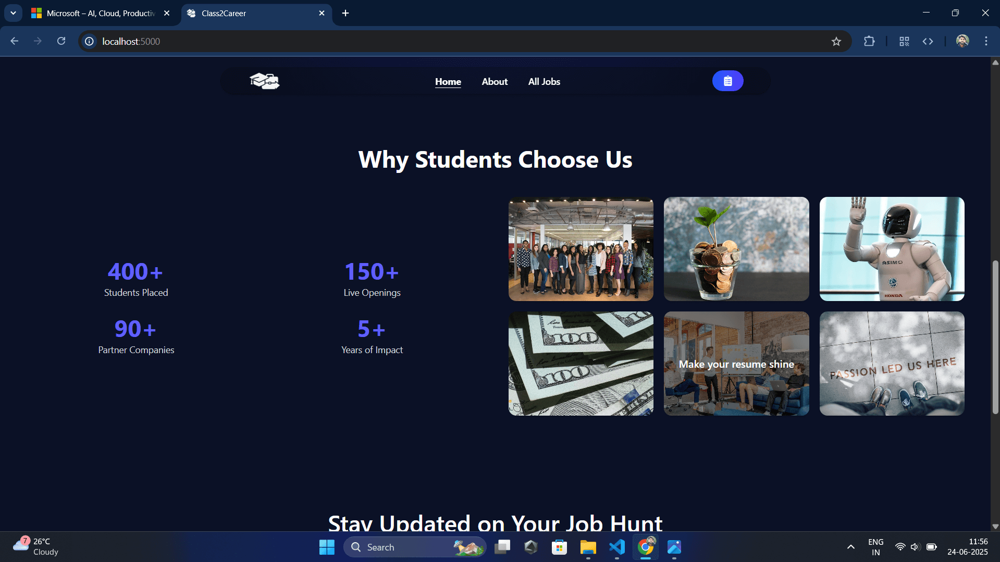
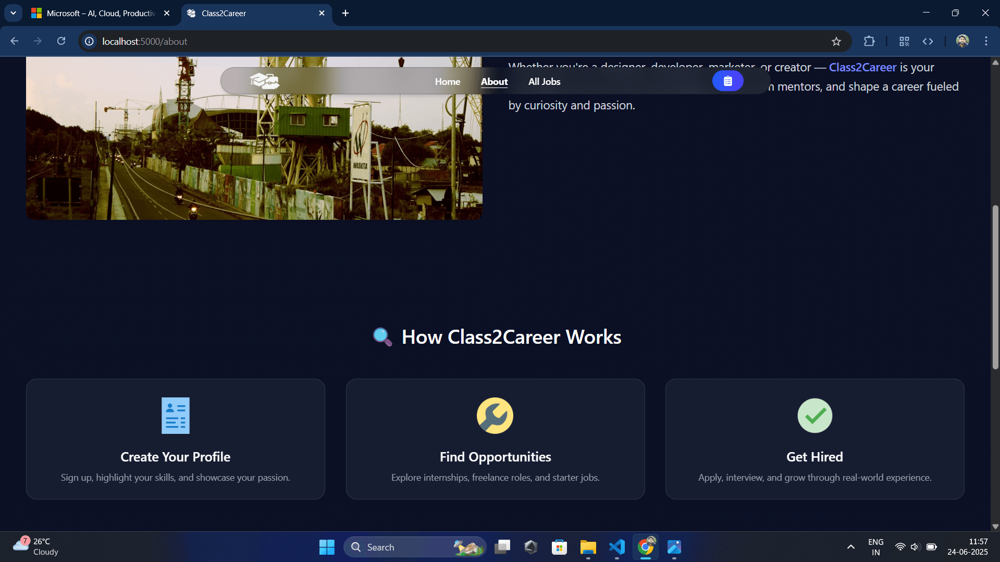
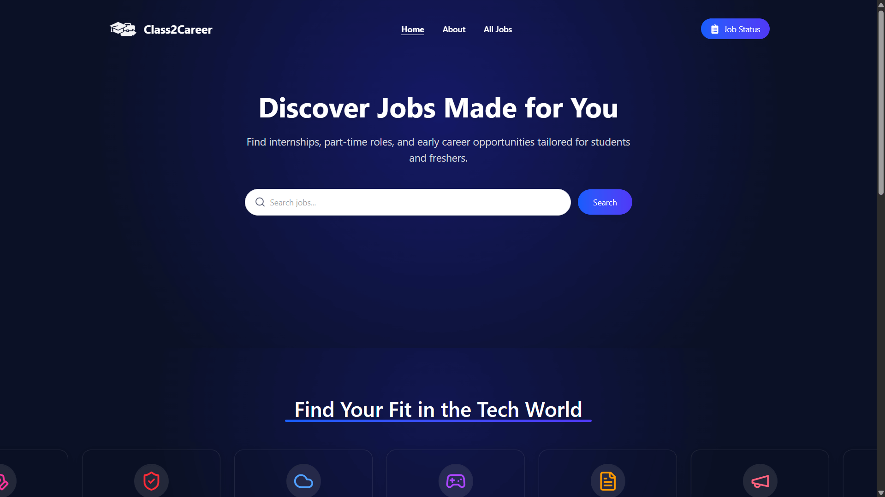
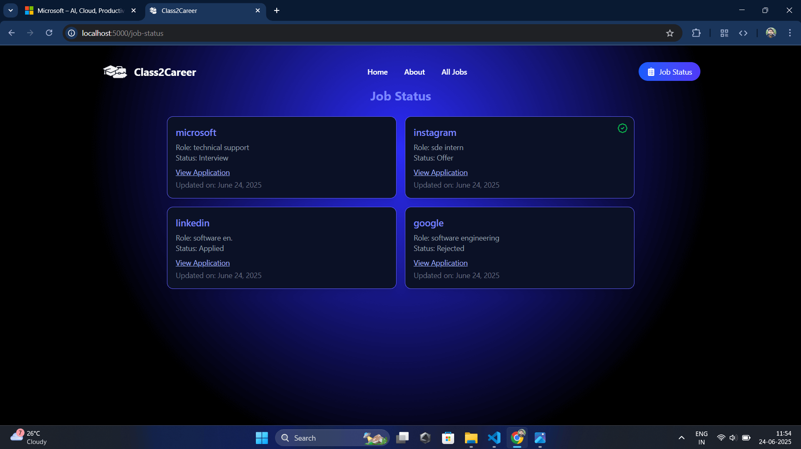
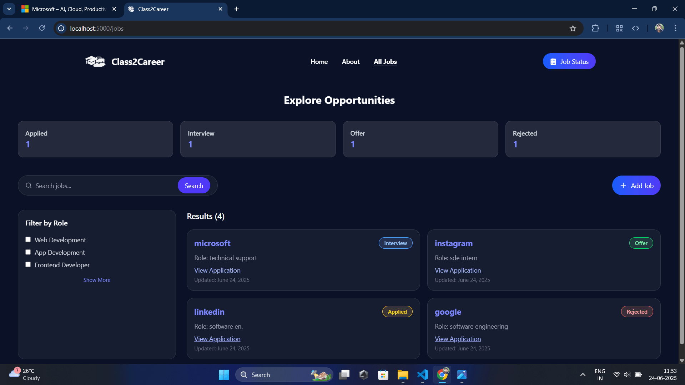

# 🎓 Class2Career — Your Personal Job Tracker

A beautifully designed **MERN** stack application that helps students and job seekers keep track of job applications effortlessly and efficiently.

> 🎯 Stay organized, stay ahead. Whether you're applying for internships or full-time roles, **Class2Career** gives you the power to manage every job opportunity in one place.

---

## ✨ Key Highlights

- 🔍 **Instant Search & Filter**  
  Search jobs by role, keywords, or use `/jobs?search=mern` in the URL to auto-fill.

- 📊 **Smart Status Dashboard**  
  Visual breakdown of jobs by status — Pending, Applied, Interview, Offer, Rejected.

- 📝 **Simple Add Job Form**  
  Clean, validated input fields for job details with optional application link and date.

- 🔁 **Status Transitions**  
  Easily update job status as your application progresses.

- 🔗 **External Application Link**  
  View application link in a new tab (if added).

- 🧹 **Delete with Confirmation**  
  Prevent accidental deletions with a confirmation popup.

- 📅 **Last Updated Info**  
  Track when each job was last modified.

- 📱 **Fully Responsive UI**  
  Built with Tailwind CSS to work on all screen sizes — from mobile to desktop.

---

## 🎨 Sneak Peek


  |  |  |  |  |

> 💡 *Dark-themed UI designed for focus and clarity.*

---

## 🛠️ Tech Stack

### Frontend
- **React.js**
- **Tailwind CSS**
- **React Router**
- **Lucide Icons**
- **React Hot Toast**

### Backend
- **Node.js**
- **Express.js**
- **MongoDB** with **Mongoose**

### State Management
- **React Context API**

### Deployment
- **Render** (for both client and server)

---

## 🚀 Getting Started

### 1. Clone the Repository

```bash
git clone https://github.com/anksindia/Class2Career-Your-Personal-Job-Tracker.git
```
## 📄 License

This project is licensed under the MIT License.

## 👥 Contributing

Pull requests and feedback are welcome!

## 🙏 Acknowledgements

<p align="center">  </p> <p align="center"> Built with 💙 by <a href="https://github.com/anksindia" target="_blank">@anksindia</a> </p>
